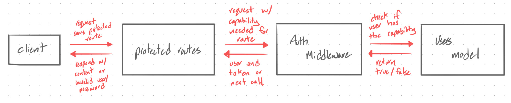

 LAB 14
=================================================

## Access Control

### Author: Jagdeep Singh

### Links and Resources
* [submission PR](https://github.com/401-advanced-javascript-js/lab-14-access-control/pull/1) 
* [travis](https://www.travis-ci.com/401-advanced-javascript-js/lab-14-access-control) 
<!-- * [back-end](http://xyz.com)  -->
<!-- * [front-end](http://xyz.com) (when applicable)  -->

<!-- #### Documentation
* [api docs](http://xyz.com) (API servers)
* [jsdoc](http://xyz.com) (Server assignments) -->

### Setup
#### `.env` requirements
* `PORT` - Port Number
* `MONGODB_URI` - URL to the running mongo instance/db
* `API_URL` - URL of deployed app
* `GOOGLE_CLIENT_ID` - Client ID from registering app with google
* `GOOGLE_CLIENT_SECRET` - Client Secret from registering app with google
* `SECRET` - Random unique string used for encoding
* `TOKEN_LIFETIME` - Expire time for token
* `SINGLE_USE_TOKENS` - 

#### Running the app
* `npm start`
  
#### Tests
* How do you run tests?

  `npm test`

#### UML

